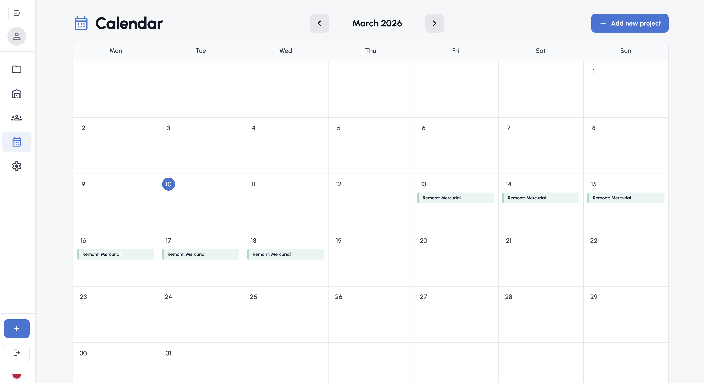
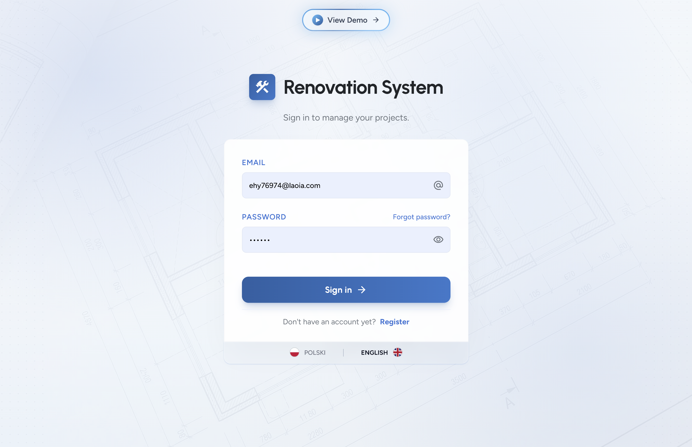
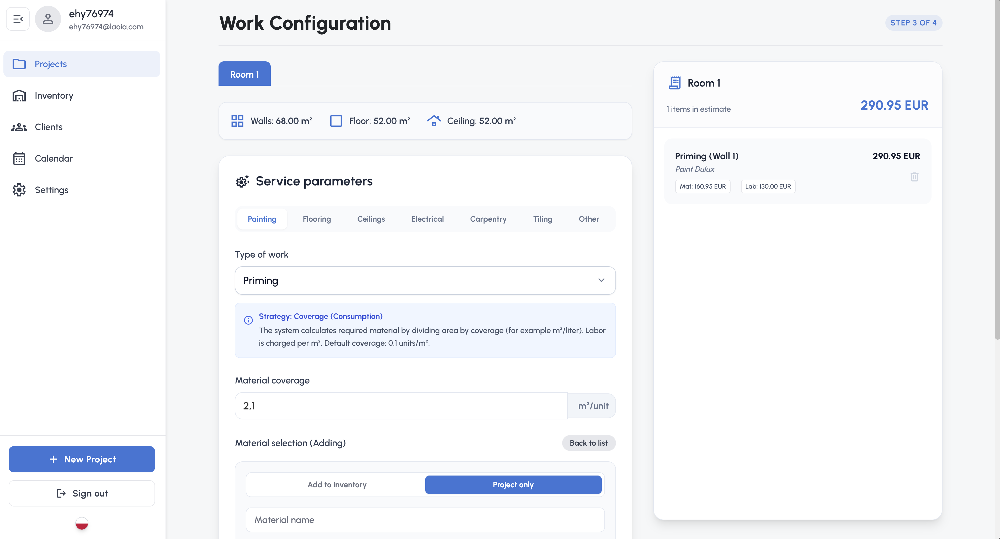
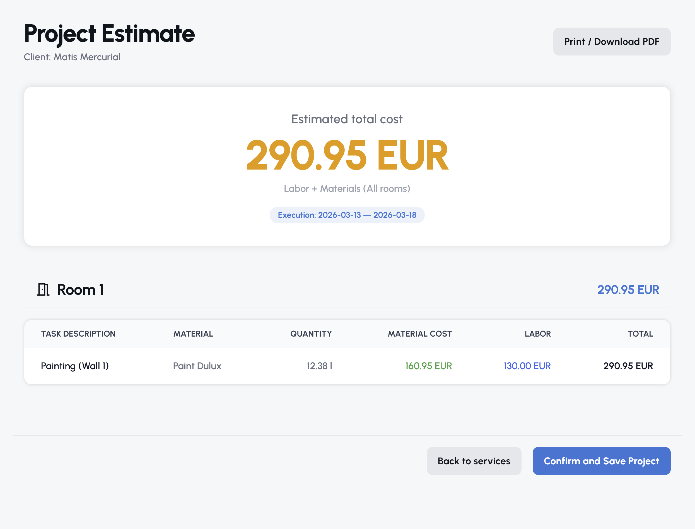

# 🛠️ Renovation System

**Renovation System** is a cloud-based Estimation & Project Management platform built for modern construction teams. It moves the renovation workflow out of spreadsheets and into a smart, integrated application.

🚀 **Ready to use for renovation companies!** The application is production-ready, supports dual languages (**English & Polish**), and **works flawlessly on mobile devices** — allowing you to manage projects, check inventory, and create estimates directly from the construction site!

🔗 **[Live Demo](https://stvshy.github.io/renovation-system/)**  

## 📸 Application Overview

### 📅 Project Timeline & Calendar

*A centralized view of all active projects, calendar schedules, and quick actions.*

### 👥 Client Management (Mobile Ready!)

*Built-in CRM to manage your clients. Fully responsive and optimized for mobile screens.*

### 📐 Room Configuration Wizard

*Defining room dimensions and subtracting openings for precise area calculation.*

### 🧮 Service & Material Estimator

*Selecting services (e.g., Painting) and mapping them to inventory items with automatic cost calculation.*

### 📄 Final Offer Summary

*The generated cost breakdown ready to be printed or exported as a PDF for the client.*

### ⚙️ Settings & Customization

*Define your own service types, calculation strategies, and custom labor rates.*

 

## 🚀 Key Capabilities

### 1. 📐 Intelligent Room & Surface Logic
Unlike basic calculators, Renovation System uses a sophisticated geometry engine.
* **Flexible Room Definitions:** Define rooms using standard "Box Mode" (L x W x H) or complex "Custom Mode" (adding individual walls/surfaces manually).
* **Smart Subtractions:** Add openings (Windows, Doors) to any surface. The system automatically calculates the *Net Area* for accurate material ordering.
* **Surface Categorization:** Distinguishes between Walls, Floors, Ceilings, and Perimeters for specific service mapping.

### 2. 🧮 Advanced Calculation Strategies
The core of the application is powered by a flexible **Strategy Pattern** engine (`renovationLogic.ts`). It supports various estimation methods per service:
* **Consumption Strategy:** Calculates based on coverage (e.g., paint coverage: 10m²/l).
* **Waste Factor Strategy:** Adds a safety margin percentage (e.g., tiling + 10% waste).
* **Linear Strategy:** For perimeter items like skirting boards.
* **Item Count:** For unit-based tasks like installing sockets or doors.

### 3. 📦 Inventory Integration
* **Real-time Stock:** Keeps track of your warehouse materials.
* **Auto-Deduction:** When a project offer is finalized, the system automatically reserves or subtracts the required materials from your inventory, preventing stock shortages.

### 4. 👥 Client & Project Management (CRM)
* **Client Database:** Store contact details and history.
* **Project Timeline:** Visual Calendar view and status tracking (Planned, In Progress, Completed).
* **Financial Overview:** Instant calculation of Labor Costs vs. Material Costs vs. Grand Total.

 

## 🛠️ Technology Stack

The application is built as a modern Single Page Application (SPA) leveraging the power of Serverless Backend.
* **Frontend:** React 19, TypeScript, Vite.
* **Styling:** Tailwind CSS for a responsive, Dark-Mode ready UI.
* **State Management:** React Context API + Custom Hooks.
* **Backend & Database:** Supabase (PostgreSQL).
* **Authentication:** Supabase Auth (Secure Email/Password login).
* **Icons:** Google Material Symbols.

 

## 🔄 How It Works (The Workflow)

1.  **Register/Login:** Create an account to isolate your data.
2.  **Add Inventory:** Populate your warehouse with materials.
3.  **Configure Services:** Go to Settings to define standard services (e.g., "Painting", "Tiling") and their default prices/materials.
4.  **Create Project:**
    -   Select or create a client.
    -   Add rooms (define walls, floors, openings).
    -   Apply services to specific surfaces (e.g., "Paint Wall A", "Tile Floor").
5.  **Finalize:** Review the Offer Summary. Clicking "Save & Finalize" will generate the project record and deduct materials from inventory.

 

## 🔒 Security & Data

* **Row Level Security (RLS):** Data is secured via Supabase RLS policies, ensuring users can only access their own projects and clients.
* **Encrypted Sessions:** User sessions are managed via secure JWT tokens.

 

## 📄 License

This project is proprietary software developed for internal renovation management.
